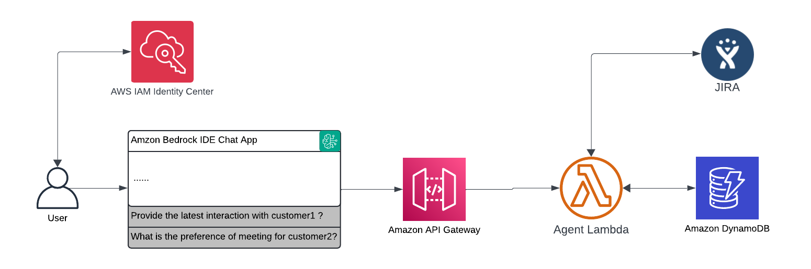

# GenAI CRM Agent Demo

This repository provides supplemental artifacts for our blog post "Create generative AI agents that interact with your company's systems in a few clicks". A demo that enables natural language interactions with CRM systems and JIRA using Amazon Bedrock IDE in Amazon SageMaker Unified Studio. This solution helps sales teams and project managers efficiently access customer information and manage JIRA tasks through an AI-powered chat interface.

## Key Features

- Natural language querying of customer information, customer preference
- Real-time JIRA task management
- Meeting scheduling optimization
- Secure authentication via organizational SSO

## Architecture



### Provisioned Resources

The CloudFormation template creates:
- Creates a random 10-char secret in Secrets Manager.
- Creates three additional secrets in Secrets Manager for JIRA_URL, JIRA_API_KEY_ARN, JIRA_USER_NAME.
- Creates two DynamoDB tables (CUSTOMER_TABLE and INTERACTION_TABLE).
- Loads customer data & interactions data to DynamoDB
- Creates a Jira Lambda function (with provided code) and integrates it with API Gateway.
- Creates a Lambda authorizer that checks x-api-key against the secret.
- Creates a REST API Gateway secured by the authorizer.

## Prerequisites

- AWS CLI (v2.x)
- AWS SDK (v3.x)
- Python 3.10 or later
- AWS account with appropriate permissions
- JIRA account with API Key

## Quick Start

1. Clone this repository
```bash
git clone https://github.com/aws-samples/genai-crm-agent-demo.git
cd genai-crm-agent-demo
```

2. Configure AWS Secret Manager keys/values:
        JIRA_API_KEY_ARN
        JIRA_URL
        JIRA_USER_NAME

3. Deploy the backend infrastructure:
```bash
aws cloudformation create-stack \
    --stack-name genai-crm-agent-demo \
    --template-body file://cloudformation/resource_template.yaml \
    --capabilities CAPABILITY_NAMED_IAM
```

4. Build the Chat App in Bedrock IDE:
Detailed deployment instructions are available in the blog post to create Bedrock IDE and integrate with the API Gateway endpoint


## Example Use Cases
1. Customer Information Retrieval:
``` 
# Example natural language query

"Give me a brief overview of customer C-jkl101112."
"List the last 2 recent interactions for customer C-def456."
"What communication method does customer C-mno131415 prefer?"
"Recommend optimal time and contact channel to reach out to C-ghi789 based on their preferences and our last interaction."
```

2. JIRA Task Management:
```
# Example natural language query

"What are the open JIRA Tasks for project id CRM?"
"Please update JIRA Task CRM-3 to 1 weeks out."
```

## Clean Up
1. Delete CloudFormation stack
```bash
aws cloudformation delete-stack --stack-name genai-crm-agent-demo
```
2. Delete any manually created resources
    Delete Function component in Amazon Bedrock IDE
    Delete Chat Agent app
    Delete SageMaker Unified Studio domains

## Costs
This solution uses pay-as-you-go AWS services. Key cost components:
- Amazon Bedrock model usage
- API Gateway requests
- Lambda function execution
- Database operations
